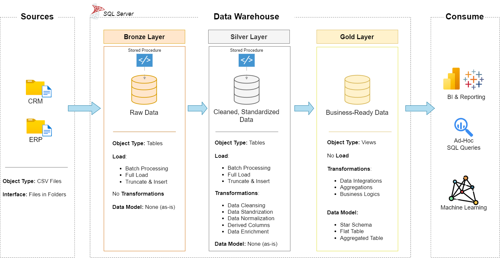

# Data Warehouse Project 🚀

This project showcases the development of a complete data warehouse solution, from raw data ingestion to structured data modeling. It demonstrates data engineering best practices for building a scalable and efficient warehouse architecture using modern data warehousing concepts.

# Data Architecture 🏗️

🥉 **Bronze Layer:** Stores raw data collected directly from source systems. Data is loaded from CSV files into the SQL Server database without major transformations.

🥈 **Silver Layer:** Focuses on data cleaning, validation, and transformation to improve data quality and prepare it for further processing.

🥇 **Gold Layer:** Contains refined and business-ready data structured using a star schema, optimized for reporting and analytical use cases.

## 📖 Project Overview

This project focuses on building a complete data warehouse solution using modern data engineering practices. It includes:

* **Data Architecture:** Designing a scalable data warehouse using the Medallion Architecture approach with Bronze, Silver, and Gold layers.
* **ETL Pipelines:** Extracting data from source systems, transforming it, and loading it into the data warehouse.
* **Data Modeling:** Creating structured fact and dimension tables designed for efficient data storage and querying.

🎯 This repository demonstrates practical skills and knowledge in:

* SQL Development
* Data Architecture
* Data Engineering
* ETL Pipeline Development
* Data Modeling

## 🎯 Project Objective

The goal of this project is to build a modern data warehouse using **SQL Server** to integrate sales data from multiple sources and create a reliable foundation for reporting and data-driven decision-making.

### 📌 Project Specifications

* **Data Sources:** Extract and load data from ERP and CRM systems provided as CSV files.
* **Data Quality:** Perform data cleaning and validation to resolve inconsistencies and improve data reliability.
* **Data Integration:** Combine data from multiple sources into a unified and user-friendly data model optimized for analytical queries.
* **Data Scope:** Work with the latest available dataset without implementing historical data tracking.
* **Documentation:** Create clear documentation of the data architecture and data model to support both technical and business users.

## 📂 Repository Structure

## 🌟 About Me
I am a data enthusiast with a strong focus on data engineering and analytics. I primarily work with SQL to build, transform, and analyze data to generate meaningful business insights.

I have practical experience in designing data pipelines and developing data warehouse solutions using SQL. My goal is to convert raw data into structured and reliable datasets that support data-driven decision-making.

I am actively seeking opportunities in freelancing, remote, and onsite roles where I can apply and grow my expertise in data engineering and analytics.

## 📬 Links & Contact

- 📧 Email: muhammadashar824@gmail.com  
- 💼 LinkedIn: www.linkedin.com/in/muhammad-ashar-6a10ab3b1  
- 💻 GitHub: https://github.com/asharfaisal

Feel free to connect with me for collaboration, freelance work, or opportunities in data engineering and analytics.

                             A special thanks to @DataWithBaraa for inspiring me to work on this project :)

