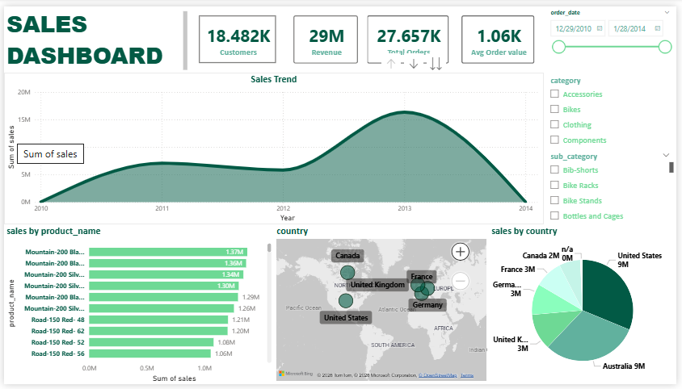

# 📊 Sales Dashboard - Power BI

## Overview

This interactive Power BI dashboard was developed using the Gold Layer of the SQL Data Warehouse. It provides business users with an easy way to monitor sales performance, customer activity, product performance, and geographical sales distribution.

The dashboard is fully interactive and allows users to filter data by date, product category, and sub-category.

---

## Dashboard Preview



---

# Dashboard Features

### KPI Cards

The dashboard includes key business metrics:

- Total Revenue
- Total Customers
- Total Orders
- Average Order Value

These KPIs provide an instant overview of business performance.

---

### Sales Trend

Displays revenue over time to identify growth patterns and seasonal trends.

**Insights**

- Revenue trend by Year
- Easy identification of peak sales periods
- Supports trend analysis

---

### Product Performance

Ranks products based on total sales.

Users can quickly identify:

- Best-selling products
- Lowest-performing products

---

### Geographic Analysis

The map visualizes sales by country, allowing users to understand regional performance.

Included visuals:

- Bubble Map
- Sales by Country Pie Chart

---

### Interactive Filters

Users can filter the report by:

- Order Date
- Product Category
- Product Sub-category

All visuals update automatically based on the selected filters.

---

# Data Source

The dashboard connects directly to the **Gold Layer** of the SQL Data Warehouse.

Pipeline:

CSV Files

↓

Bronze Layer

↓

Silver Layer

↓

Gold Layer

↓

Power BI Dashboard

---

# Tools Used

- Microsoft Power BI
- SQL Server
- DAX
- Power Query
- Star Schema Data Model

---

# Skills Demonstrated

- Data Modeling
- Dashboard Design
- KPI Development
- Data Visualization
- Business Intelligence
- DAX Calculations
- Interactive Reporting

---

# Dashboard Objectives

- Monitor business performance
- Analyze sales trends
- Track customer growth
- Identify top-performing products
- Explore geographical sales distribution
- Support data-driven decision making

---

# Project Structure

```
powerbi/
│
├── Sales_Dashboard.pbix
├── sales-dashboard.png
└── README.md
```

---

